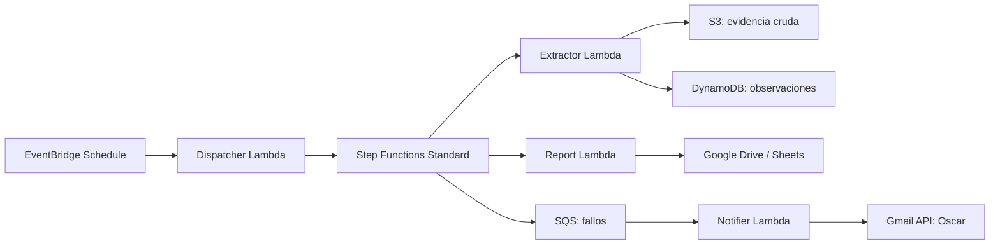

# Pipeline de precios comparativos

Pipeline serverless para monitorear una lista corta de productos dermo-cosméticos en Flora y Fauna, Dermashop e Inkafarma.

## Arquitectura



## Estructura

- `src/`: handlers Lambda y configuración de productos.
- `infra/template.yaml`: infraestructura como código SAM/CloudFormation.
- `scripts/build_lambda_package.sh`: empaqueta dependencias para Python 3.13 en Lambda.
- `docs/arquitectura.drawio`: diagrama editable solicitado.
- `docs/COSTEO_AWS.md`: supuestos para la AWS Pricing Calculator.
- `docs/GOOGLE_OAUTH_SETUP.md`: autorización local y carga segura del secreto OAuth.
- `docs/COBERTURA_FUENTES.md`: cobertura real y límites verificables de las URLs objetivo.
- `docs/EVIDENCIA_DESPLIEGUE.md`: guion de las capturas requeridas.
- `tests/`: pruebas unitarias sin AWS.

## Configuración Google OAuth

1. Crear un proyecto Google Cloud y habilitar Google Drive API, Google Sheets API y Gmail API.
2. Crear un cliente OAuth para aplicación de escritorio y autorizar la cuenta Google que administrará Drive y enviará correo.
3. Solicitar scopes de Drive, Sheets y `gmail.send`.
4. Generar un JSON de credenciales con refresh token y guardarlo en AWS Secrets Manager.
5. Pasar el ARN de ese secreto en el parámetro `GoogleOAuthSecretArn` del stack.

El secreto debe contener el JSON de OAuth completo que usa `google.oauth2.credentials.Credentials.from_authorized_user_info`. No versionar ni subir ese archivo.

## Build y validación

```bash
./scripts/build_lambda_package.sh
PYTHONPATH=src:build python3 -m unittest discover -s tests -v
aws cloudformation validate-template \
  --template-body file://infra/template.yaml \
  --profile aje-test --region sa-east-1
```

El build usa wheels Linux compatibles con Lambda; no copiar dependencias instaladas directamente en macOS a la carpeta desplegable.

## Despliegue

Primero crear el secreto OAuth y obtener su ARN. Después de construir el paquete:

```bash
aws cloudformation package \
  --template-file infra/template.yaml \
  --s3-bucket <bucket-de-artefactos> \
  --output-template-file packaged.yaml \
  --profile aje-test --region sa-east-1

aws cloudformation deploy \
  --template-file packaged.yaml \
  --stack-name aje-competitor-prices \
  --capabilities CAPABILITY_IAM \
  --parameter-overrides GoogleOAuthSecretArn=<arn-del-secreto> \
  --profile aje-test --region sa-east-1
```

El bucket de artefactos es distinto del bucket de evidencia que crea el stack. Crear uno con nombre globalmente único antes de ejecutar `package`.

Para ejecutar las verificaciones y el despliegue con parámetros explícitos:

```bash
./scripts/preflight.sh aje-test sa-east-1
./scripts/deploy.sh <bucket-de-artefactos> <arn-del-secreto> aje-test sa-east-1
```

## Uso de IA en la solución

Se utilizó Codex como asistente de desarrollo para estructurar el análisis, proponer el diagrama, generar el esqueleto de IaC y revisar casos de error. Las decisiones revisadas por el candidato fueron: modelo de datos por corrida, Step Functions Standard para orquestación visible, extracción sin evasión de controles de los sitios, uso de SQS como cola de fallos y Gmail API para cumplir la notificación real desde una cuenta AWS nueva.

Prompts principales: “analiza el enunciado y separa requisitos verificables”, “propón un pipeline serverless event-driven con reintentos y DLQ”, “diseña el modelo DynamoDB para observaciones por corrida” y “revisa el template CloudFormation para IAM mínimo y manejo de fallos”.

## Limitaciones declaradas

- La equivalencia de productos se controla mediante la lista `src/product_targets.json`; no intenta unir catálogos completos por similitud de texto.
- Los sitios pueden cambiar HTML, requerir ubicación o bloquear solicitudes. Cada extractor falla de manera trazable y el pipeline continúa con las fuentes restantes.
- La notificación usa Gmail API porque SES/SNS no garantizan el envío inmediato a un tercero desde una cuenta AWS nueva sin verificaciones externas.
